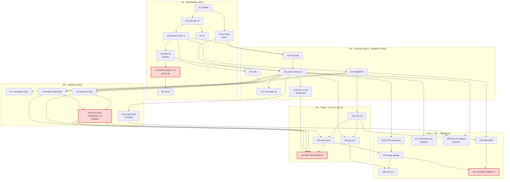

# spaxlet — GitHub Project Spec (review before creating)

**Repo:** `Majoburo/spaxlet` (private) · **License:** MIT (matches scarlet) · 2-year horizon.
**Tagline:** *scarlet for spaxels* — joint point-source deblending + kinematic forward modeling of JWST IFU cubes.

This file is the source of truth for the GitHub setup. Once approved, I create the milestones,
labels, and issues via `gh`. Edit anything here first.

---

## Milestones (map to the M1–M6 gates in POSTDOC_PROJECT_PLAN.md)

| Milestone | Due (mo) | Gate / success criterion |
|---|---|---|
| **M1 — Identifiability (go/no-go)** | 3 | Recover injected disk+point-source params from synthetic cube |
| **M2 — Proximal engine + WebbPSF** | 6 | Exact constraints hold; faster than soft baseline; realistic PSF |
| **M3 — Method validated** | 9 | Matches GalPaK³ᴰ; beats per-slice; recovers nuclear kinematics |
| **M4 — Method paper + tool v0.1** | 12 | Paper submitted, code public, pip-installable |
| **M5 — Science sample** | 18 | Posteriors on a real JWST target sample |
| **M6 — Tool v1.0 + science paper** | 24 | v1.0 released, second paper submitted |

## Labels
- **type:** `type:infra`, `type:feature`, `type:science`, `type:validation`, `type:docs`, `type:research`, `type:paper`
- **area:** `area:forward-model`, `area:optimizer`, `area:constraints`, `area:psf`, `area:io`, `area:synth`, `area:kinematics`
- **priority:** `prio:critical` (gates a milestone), `prio:high`, `prio:normal`
- **meta:** `good-first-step`, `blocked`, `stretch`

---

## Dependency flow diagram


*Red nodes are the milestone gates / starred deliverables. The leftmost chain `#1→#3→#5→#6→#7`
is the fast path to the go/no-go.*

## ISSUES

> Format: **#N Title** · milestone · labels · *depends on* · **Acceptance criteria**.
> Numbers are placeholders for ordering (GitHub assigns real numbers).
> **Sub-tasks** are rendered as GitHub task-list checkboxes inside the parent issue body — they
> show a progress bar and (for issue-refs) auto-link as tracked sub-issues.

### Phase: Stage 0 — Skeleton & synthetic data  (Mo 1–2, → M1)

**#1 Repo scaffold & environment**
M1 · `type:infra` `good-first-step` · *depends: none*
- pyproject (jax, optax, jaxopt, proxmin, astropy, numpy, pytest), src layout `spaxlet/`, CI (pytest on push), MIT license, README stub, pre-commit (ruff/black).
- **AC:** `pip install -e .` works; `pytest` runs (even if empty); CI green on a trivial test.

**#2 Seed planning docs into repo**
M1 · `type:docs` `good-first-step` · *depends: #1*
- Copy `POSTDOC_PROJECT_PLAN.md`, `KINEMATIC_IFU_PLAN.md` into `docs/`.
- **AC:** docs render on GitHub; README links to them.

**#3 Synthetic cube generator (`synth.py`) — the "truth machine"**
M1 · `type:feature` `area:synth` `prio:critical` · *depends: #1*
- Generate 30×30×~50 cube: rotating-disk emission line + smooth continuum + PSF point source ⊗ toy PSF + noise. Returns cube **and** ground-truth param dict.
- **Sub-tasks:**
  - [ ] Rotating-disk velocity field $v(x,y)$ from (incl, PA, center, v_max, r_t)
  - [ ] Per-spaxel Doppler-shifted + broadened emission line ($\sigma$, flux, $\lambda_0$/z)
  - [ ] Smooth continuum component (morphology × SED)
  - [ ] Point source: flux, sub-spaxel position, point-source spectrum
  - [ ] Toy per-channel PSF convolution + Gaussian noise + weight map
  - [ ] Return `(cube, truth_dict)`; truth round-trips through forward model
  - [ ] Unit tests: shapes, flux conservation, noise level
- **AC:** channel maps visibly show a rotating line + a point source; truth dict round-trips; tests pass.

**#4 Visualization utilities**
M1 · `type:feature` `area:synth` `good-first-step` · *depends: #3*
- Channel-map montage, moment-0/1 maps, spectrum-at-spaxel, residual plot, truth-vs-fit overlay.
- **AC:** one function each; used by the synth notebook and later fit reports.

### Phase: Stage 1 — Minimal Working Version  (Mo 3, → **M1 gate**)

**#5 Differentiable forward model: point source + parametric disk line (`forward.py`)**
M1 · `type:feature` `area:forward-model` `prio:critical` · *depends: #3*
- JAX render of point source + parametric rotating-disk emission line, fully differentiable.
- **Sub-tasks:**
  - [ ] Component interface `render(params) → cube_contribution` (swappable)
  - [ ] Point-source component (`flux·PSF_λ` at sub-spaxel (x₀,y₀))
  - [ ] Parametric disk-line component (mirrors synth's kinematic model, differentiable)
  - [ ] Reparametrization: softplus fluxes, bounded/transformed angles
  - [ ] Per-channel PSF convolution op (JAX, behind `psf(λ)→kernel` interface)
  - [ ] Scene = sum of components; `jax.jit` + `jax.grad` clean
  - [ ] Test: forward(truth) ≈ synth output (within noise)
- **AC:** `forward(params)` returns a cube; `jax.grad` runs; matches `synth` at truth params.

**#6 MWV fit loop (`fit_mwv.py`, optax Adam)**
M1 · `type:feature` `area:optimizer` `prio:critical` · *depends: #5*
- Adam optimization of forward model against synthetic cube; logging; truth-vs-fit report.
- **AC:** converges; recovers injected params on a clean synthetic cube.

**#7 ★ Identifiability experiment (go/no-go)**
M1 · `type:research` `prio:critical` · *depends: #6*
- Does the joint fit separate point-source flux from nuclear rotation, and where does it break?
- **Sub-tasks:**
  - [ ] Grid of synthetic cubes over point-source/host contrast × SNR
  - [ ] Run MWV fit on each; record recovered-vs-truth error per param
  - [ ] Recovery-error vs. contrast/SNR plot (esp. nuclear v_max, σ)
  - [ ] Failure-mode analysis: where/why it degenerates (bright nucleus regime)
  - [ ] **Go/no-go recommendation** written down
- **AC:** report + plot; explicit go/no-go. *This closes M1.*

**#8 Identifiability writeup (internal memo)**
M1 · `type:docs` `type:paper` · *depends: #7*
- 1–2 page memo: setup, result, decision. Becomes the seed of the method paper's validation section.
- **AC:** memo in `docs/`; PI sign-off.

### Phase: Stage 2 — Proximal engine + free host  (Mo 4–5, → M2)

**#9 Port scarlet1 proximal operators to JAX-compatible form**
M2 · `type:feature` `area:constraints` `prio:high` · *depends: #1*
- Bring monotonicity / symmetry / positivity / monotonic-mask from `scarlet/operator.py`+`constraint.py` into spaxlet as prox ops that operate on JAX arrays (or via host-callback).
- **AC:** each prox has a unit test verifying the constraint holds exactly after projection.

**#10 Free pixel-grid continuum-host component**
M2 · `type:feature` `area:forward-model` · *depends: #5, #9*
- Add a non-parametric continuum host (pixel morphology × continuum SED) as a swappable component.
- **AC:** renders; composes with point source + disk line in one scene.

**#11 Proximal-gradient outer loop**
M2 · `type:feature` `area:optimizer` `prio:critical` · *depends: #6, #9, #10*
- `θ⁺ = prox_C(θ − η∇L)`: autodiff gradient + exact projection on free-morphology; reparametrized blocks plain.
- **Sub-tasks:**
  - [ ] Block structure: which params get prox vs. reparametrized autodiff
  - [ ] Autodiff gradient of full likelihood (all components)
  - [ ] Apply composed prox (positivity ∘ monotonic ∘ symmetric) to morphology block
  - [ ] Step-size / convergence criterion; iteration logging
  - [ ] Assert constraints satisfied each step (not just penalized)
  - [ ] Fit report: truth-vs-fit on a 3-component synthetic scene
- **AC:** fits {point source + constrained continuum + kinematic line}; **constraints hold exactly.**

**#12 Two-stage initialization (spectral init → refine)**
M2 · `type:feature` `area:optimizer` · *depends: #11*
- Tailored init (point source at detection centroid, disk geometry from moments, continuum from median) → proximal refine. Keeps factorization shallow/low-rank (benign-landscape rule).
- **AC:** improved convergence & basin stability vs. random init on synthetics.

**#13 Benchmark: exact-prox vs. soft-penalty (the scarlet2 lesson)**
M2 · `type:validation` `prio:high` · *depends: #11*
- Compare exact proximal vs. a soft-penalty baseline on constraint satisfaction *and* wall-clock/iters.
- **AC:** plot showing exact constraints hold + faster/fewer-iters than soft. (Paper figure.)

### Phase: Stage 3 — Realism  (Mo 6–8, → M2 close / M3)

**#14 WebbPSF per-channel PSF cube**
M2 · `type:feature` `area:psf` `prio:high` · *depends: #5*
- Generate/ingest WebbPSF per-λ kernels for NIRSpec IFU; swap toy PSF behind the `psf(λ)→kernel` interface.
- **AC:** forward model uses realistic PSF; undersampling at blue end handled (sub-spaxel).

**#15 LSF (spectral) convolution**
M2 · `type:feature` `area:forward-model` · *depends: #5*
- Line-spread-function convolution along λ.
- **AC:** modeled line widths match instrument LSF on synthetics.

**#16 Implicit-differentiation joint-fit mechanism (JAXopt)**
M3 · `type:research` `area:optimizer` `prio:high` · *depends: #11*
- Where the kinematic fit is nested, differentiate through the solution (implicit function theorem / JAXopt) instead of unrolling. Compare memory/speed vs. unrolled.
- **AC:** implicit-diff path matches unrolled gradients (within tol) at lower memory/time. (Addresses scarlet2 slowness.)

**#17 Correlated-noise-aware likelihood**
M3 · `type:feature` `area:optimizer` `prio:high` · *depends: #11*
- Use jwst error/covariance properly (down-weight / covariance handling) so error bars aren't overconfident.
- **AC:** recovered uncertainties calibrated against synthetic-with-correlated-noise truth.

### Phase: Stage 4 — Validation  (Mo 7–9, → **M3 gate**)

**#18 Reproduce GalPaK³ᴰ on masked-nucleus disks**
M3 · `type:validation` `prio:critical` · *depends: #11, #14, #15*
- No point source; fit a pure disk; must match GalPaK³ᴰ recovery within published tolerances.
- **AC:** agreement table on a shared synthetic set.

**#19 Beat per-slice deblending (Vietri+2024) when AGN is sub-dominant**
M3 · `type:validation` `prio:critical` · *depends: #11, #14*
- Reproduce a per-slice baseline; show joint+kinematic does better, esp. low AGN/host contrast.
- **AC:** comparison plot; quantified improvement. (Headline figure.)

**#20 ★ Nuclear-kinematics recovery (the headline result)**
M3 · `type:validation` `type:science` `prio:critical` · *depends: #18, #19*
- Demonstrate recovery of nuclear-region kinematics that masking discards.
- **Sub-tasks:**
  - [ ] Synthetic: known velocity field through a bright-nucleus region
  - [ ] Fit with spaxlet (joint) vs. mask-then-fit baseline (GalPaK³ᴰ-style)
  - [ ] Compare recovered v(x,y) in the nucleus; quantify what masking loses
  - [ ] Robustness across contrast/SNR (tie to #7 regime)
  - [ ] Headline figure: recovered nuclear velocity field vs. masked
- **AC:** figure showing recovered velocity field through the nucleus vs. masked baseline. *Closes M3.*

### Phase: Stage 5a — First real data + paper  (Mo 10–12, → **M4 gate**)

**#21 jwst `s3d` I/O (cube + ERR + DQ)**
M4 · `type:feature` `area:io` `prio:high` · *depends: #14*
- Read pipeline cubes, error arrays, DQ; basic masking; WCS.
- **AC:** load a real NIRSpec IFU cube end-to-end into the model.

**#22 Run on 1–2 real JWST cubes (SN-in-host and/or AGN-host)**
M4 · `type:science` `prio:critical` · *depends: #20, #21*
- First real-data deblend + kinematics.
- **AC:** sensible deblended point-source spectrum + host velocity field on real data.

**#23 Package as pip-installable v0.1 (config-driven, docs, tests)**
M4 · `type:infra` `type:docs` `prio:high` · *depends: #11, #21*
- Config schema (components, per-component constraints, line list/redshift prior), tutorials, test suite.
- **AC:** `pip install spaxlet` (or TestPyPI) works; quickstart notebook runs; v0.1 tag.

**#24 ★ Method paper**
M4 · `type:paper` `prio:critical` · *depends: #13, #18, #19, #20, #22*
- Write & submit the method paper.
- **Sub-tasks:**
  - [ ] Intro + the gap (cite scarlet, GalPaK³ᴰ, Vietri+2024, Li+2025 motivation)
  - [ ] Method: forward model + proximal engine + implicit-diff + landscape rationale
  - [ ] Validation figures: #13 (prox vs soft), #18 (GalPaK³ᴰ), #19 (per-slice), #20 (nuclear)
  - [ ] Real-data section (#22)
  - [ ] Code/data availability; tag release
  - [ ] Co-author review → submit → arXiv
- **AC:** submitted; preprint on arXiv; code release tagged. *Closes M4.*

### Phase: Year 2 — Science + extensions  (Mo 13–24, → M5, M6)

**#25 Bayesian mode: numpyro/NUTS posteriors on disk params**
M5 · `type:feature` `area:optimizer` · *depends: #11*
- **AC:** posterior distributions on kinematic params; coverage tested on synthetics.

**#26 Assemble & run a real JWST target sample**
M5 · `type:science` `prio:high` · *depends: #22, #25*
- **AC:** sample table + per-target deblend+kinematics results.

**#27 Variance-reduced stochastic proximal gradient (minibatch the cube)**
M6 · `type:research` `area:optimizer` `stretch` · *depends: #11*
- Subsample channels/spaxels per step for speed, keep exact constraints.
- **AC:** speedup demonstrated without constraint/accuracy loss.

**#28 Free-velocity-residual extension (disturbed/merging systems)**
M6 · `type:feature` `area:kinematics` `stretch` · *depends: #11, #16*
- Optional per-pixel velocity correction on top of the parametric disk (with TV/smoothness prox).
- **AC:** recovers a disturbed velocity field a pure disk can't.

**#29 MIRI MRS support**
M6 · `type:feature` `area:psf` `area:io` · *depends: #14, #21*
- Longer-λ PSF/sampling regime, 12-band stitching, fringing caveats.
- **AC:** runs on a real MRS cube.

**#30 Tool v1.0 (docs, tutorials, community-ready)**
M6 · `type:infra` `type:docs` `prio:high` · *depends: #23, #26*
- **AC:** v1.0 release; full docs site; ≥2 worked tutorials.

**#31 ★ Science paper (sample results)**
M6 · `type:paper` `prio:critical` · *depends: #26, #29*
- **AC:** submitted; preprint.

---

## Critical path (the chain that gates everything)
`#1 → #3 → #5 → #6 → #7(M1) → #11(M2) → #20(M3) → #24(M4) → #26 → #31(M6)`
Everything else hangs off this spine. **#7 is the early gate** — if go/no-go fails, re-scope before #11+.

## Timeline mapping (quarters)
- **Q1 (Mo1–3):** #1–#8  → **M1**
- **Q2 (Mo4–6):** #9–#15 → **M2**
- **Q3 (Mo7–9):** #16–#20 → **M3**
- **Q4 (Mo10–12):** #21–#24 → **M4**
- **Q5–6 (Mo13–18):** #25–#26 → **M5**
- **Q7–8 (Mo19–24):** #27–#31 → **M6**

## What I'll run once approved (preview, not executed yet)
```
gh repo create Majoburo/spaxlet --private --license mit --description "scarlet for spaxels: joint deblending + kinematic forward modeling of JWST IFU cubes"
# then: create 6 milestones, ~15 labels, 31 issues with the above bodies/labels/milestones,
# (optionally) a GitHub Project board grouping by milestone.
```
